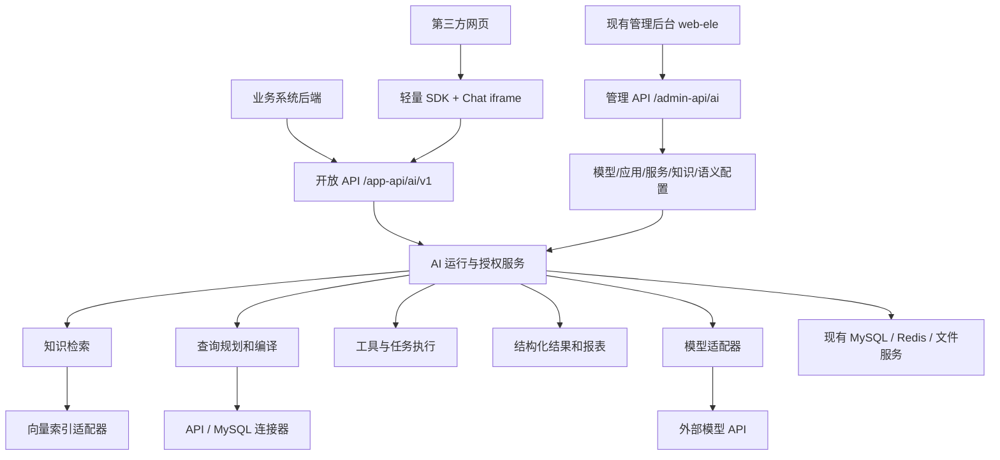

# 03 架构与集成方案

## 1. 总体结构



继续单体模块化后端、现有 server 唯一入口。首期新增一个 AI 业务模块、一个薄 API 模块和一个 AI starter；各功能是包边界，不拆成独立微服务。知识向量检索允许增加一个可选自托管索引服务，必须经过 P0 的运维与依赖验证。

## 2. 代码落位与依赖

路径均相对授权工作副本；精确前缀定义在任务索引。

```text
后端代码/basic-framework-boot/
  basic-framework-module-ai-api/       CommonApi + DTO，无实现和厂商类型
  basic-framework-module-ai/
    src/main/java/com/basicframework/module/ai/
      controller/admin/               控制面 REST 与 VO
      controller/app/v1/              开放 API 与 VO
      convert/                        边界映射
      service/                        业务用例，输入 DTO/业务 command
      domain/                         QueryPlan、ReportSpec、权限、状态
      dal/dataobject/                 DO
      dal/mysql/                      Mapper 与查询参数
      adapter/                        API、MySQL、向量库、文件与执行器适配
      framework/security/             MEMBER Provider、权限表达式实现
      framework/datapermission/       本地 AI 表数据权限登记
      job/                            恢复、清理、同步 JobHandler
      enums/                          稳定 code 与 ErrorCodeConstants
  basic-framework-core/
    basic-framework-spring-boot-starter-ai/
      core/model/                     自有模型请求、响应、能力与工厂契约
      provider/springai/              唯一允许直接引用 Spring AI 的区域
      config/                         条件装配、Properties、启动校验
  basic-framework-server/             装配、运行配置、Flyway
  basic-framework-coverage/           加入三个新增生产模块直接依赖

前端代码/basic-framework-admin/
  apps/web-ele/src/api/ai/            管理端 API
  apps/web-ele/src/views/ai/          控制面页面
  apps/ai-chat/                       独立轻量 Chat 构建入口
  packages/ai-contracts/              ResultBlock/QueryPlan/Theme 类型与校验
  packages/ai-chat-ui/                Chat 与报表 Vue 组件
  packages/ai-embed-sdk/              无 Vue 运行时依赖的纯 TS 宿主 SDK
```

管理端不复制上游后台页面，不引入另一套登录/菜单/权限。Chat 可复用项目主题和基础组件，但不加载后台路由、管理权限初始化与 ADMIN refresh 逻辑。包数量在 F04 验证后确认，不能创建没有消费者的空包。

### 2.1 稳定接口

| 契约 | 责任 | 不允许泄漏的内容 |
|---|---|---|
| ModelClientFactory / ModelPort | 按端点快照创建受管客户端，执行文本/嵌入/媒体能力 | Spring AI ChatModel/Document 不进入业务 API |
| AiRunCommonApi | 供未来跨模块调用运行服务 | Controller VO、Mapper/DO |
| KnowledgeIndexPort | upsert/delete/search/indexVersion | Qdrant protobuf/SDK 类型 |
| DataConnector | validate/describe/execute(QueryPlan) | 原始连接、任意 SQL 请求 |
| ToolExecutor | 已校验工具请求、幂等与结果 | 任意动态类名、脚本 |
| ChartRenderer | 自有 ChartSpec → 图表实例、resize/destroy | AntV DSL 成为长期报表存储协议 |
| FileCommonApi | 创建/读取/删除受控私有文件 | infra FileService/DO |

契约方法必须定义取消、超时、资源关闭与稳定错误。新增 DTO/契约按框架要求补文档、测试、ArchUnit 注册。

## 3. 上游组件选择与适配

| 组件 | 计划角色 | 集成方式 | 当前结论 |
|---|---|---|---|
| Spring AI | 文本、嵌入及后续模型适配 | BOM + 指定模型库，封装在 AI starter | 1.1.7 官方发布及 POM 已核实，Java17/Boot3.5；作为 P0 候选，构建与漏洞复核后才锁定 |
| Spring AI Alibaba | 特定模型或后续 Graph 能力 | 可选 provider 插件 | 不作为首期必需依赖；官方推荐表中的旧 Spring AI 1.1.2 存在已公布修复，不能直接复制组合 |
| AntV GPT-Vis / G2 | 浏览器图表渲染 | pnpm 固定依赖 + 自有 ChartRenderer | GPT-Vis ai 分支 package.json 为1.0.1；实际发布包、依赖体积及安全行为待 P0 验证 |
| AVA | 分析与展示流程参考 | 阅读设计 | ai 分支为4.0.0-alpha.1，首期不运行其 Node 执行器和代码执行能力 |
| Qdrant | 知识向量检索 | 可选容器 + KnowledgeIndexPort | 建议候选；增加运维组件的代价明确，客户端/服务端矩阵、ACL过滤与恢复必须先验证 |
| Apache Tika | PDF/DOCX 等文本解析 | Java 解析适配器 | 框架已有 tika-core 只负责基础能力；解析器依赖需单独加入并扫描，不能假定已具备完整解析 |
| MySQL JDBC | 外部业务只读查询 | 独立受管连接池 | 首期沿用已有技术方向；外部池不进入平台默认 Mapper 数据源 |
| Ollama | 外部模型端点 | OpenAI 兼容或独立 provider | 兼容范围为子集，逐能力探测；不在本平台实施模型安装、拉取和GPU管理 |

版本和证据归 [10](10-decisions-sources.md)，升级方式归 [06](06-upstream-upgrade.md)。不因上游存在完整平台，就把其数据库、权限、管理界面或整套运行服务搬入本产品。

## 4. 动态模型配置

1. 模型管理服务保存非秘密配置与 CredentialCipher 密文。
2. 每次run固定endpointId/configRevision/credentialRevision/modelId，检查当前启用状态和外发政策；凭据仅保存版本标识，不复制到run正文。
3. 工厂按端点版本创建客户端；密钥只在受控内存中解密，不进入缓存 key、toString、日志和 trace。
4. 客户端缓存键包含endpointId、configRevision和credentialRevision；轮换使旧客户端停止接受新请求，存量run按取消/到期策略结束。已被发布服务引用的provider/baseUrl不原地修改，地址迁移创建新端点并发布切换，避免旧配置向旧地址发送新地址的密钥。
5. provider 适配器将模型输出转换成自有事件和类型，模型返回的 tool call 交给平台执行策略，不由 SDK 自动执行任意 Bean 方法。
6. 所有客户端、连接和流都有关闭路径；动态配置不能用全局单例 baseUrl 或修改全局属性实现。

调用失败仅在同端点、允许重试且未产生外部副作用时有限重试。跨供应商切换涉及外发政策和模型语义，不作为隐式兜底。

## 5. 开放身份接缝

### 5.1 首期路径选择

使用已有 `controller.app` 扩展点，对外路径 `/app-api/ai/v1`；管理路径 `/admin-api/ai`。这样复用当前 API 前缀和路由到 MEMBER 的机制。

拟注册 `AiUserSessionCommonApi`，声明 MEMBER=1；当前源框架只提供 ADMIN Provider。外部业务用户记录在 ai_subject，不复制到 system_users。APP 主体与 USER 主体都拥有内部 subjectId，通过 subjectKind 区分其执行权限。

如果未来同一部署已存在另一个 MEMBER Provider，不能注册第二个同类型 Provider；任务 F05 必须先设计唯一路由提供者或新的通用身份接缝并更新 ADR/测试，禁止依赖 Bean 顺序。SYSTEM=0 不用于伪装普通外部调用。

### 5.2 换票与执行

- 应用客户端凭据仅在换票端点校验，随机高熵 secret 只存摘要，返回一次。
- 换票 Controller 在平台用户会话层可声明 PermitAll，但业务层必须完成客户端凭据校验、速率限制和授权；这不是匿名 AI 调用入口。
- USER 换票仅接受已认证业务后端声明的 externalUserId；scope 被应用配置裁剪。前端不能自行换取他人身份。
- access token 用高熵随机值，MySQL 存 SHA-256 摘要；不复制到 Redis 会话缓存。凭证只在浏览器内存保留。
- 每次请求读取应用/主体/授权当前状态。执行上下文含 appId、subjectId、subjectKind、授权版本和审计标识，不含管理员身份伪装。
- 外部部门/组织标识通过受信任映射或权限解析器转换成业务范围；不能直接当作本平台 system_dept.id。
- 同系统数据库场景若没有可执行的行范围策略，禁止发布该数据集给 USER。APP 主体仅可使用明确授权的服务级数据集。

这是现有认证的业务扩展，需实现阶段明确授权及安全评审。本包只给出可审查设计。

## 6. 文件复用的真实工作

现有 infra-api 只有日志相关公开契约，AI 不能直接注入 infra 的 FileService。

任务 F06 先新增 FileCommonApi 和业务文件权限 SPI（契约由 infra-api 拥有）。文件绑定包含 businessType/businessId；AI 实现该 SPI，判断知识文档、会话附件或报表当前访问权。infra 保持存储、魔数/路径/归档校验和读取执行权。

必须区分：上传者、业务所有者、读取者。不能为共享知识访问构造 `canManageFiles=true` 或冒用上传者身份。原有后台文件管理权限不能自动成为业务正文通读权。

所有新契约类型加入显式公开清单；AI→infra-api、infra→SPI 接口，infra 不依赖 AI 实现模块。循环回调只用于授权判定，不重复触发文件读取。任务需覆盖匿名、错应用、错主体、授权共享和已删除资源。

## 7. 知识检索架构

### 7.1 入库

私有文件 → ai_document_version → 持久索引任务 → 解析器 → 有来源位置的切片 → embedding → 版本化索引 → 原子切换文档可用版本。

- MySQL 保存文档权威元数据、正文位置、授权与索引版本；向量库作为可重建索引。
- embeddingModelId、modelRevision、dimension、normalization、chunkerVersion、parserVersion 共同标识索引配置。同维度的不同模型也不能混用。
- 索引写入使用稳定的 documentVersion/chunkId 幂等键；部分失败不能让未完成版本进入检索。
- 文档解析在有资源上限的受管任务中执行；限制展开量、页数、时间与内存。无法终止或隔离解析风险时 P0 评审隔离工作进程，不以开启任意执行补救。

### 7.2 检索

1. 从当前应用、服务和主体权限解析允许的 KB/文档/安全分区。
2. 权限过滤条件由服务端类型化构造，并附在向量搜索中；不接受用户或模型给出的过滤表达式。
3. 对返回 chunk 再次校验当前文档版本、可见性和 ACL；通过后才读取正文并送给模型。
4. 引用绑定真实 chunkId 和文档版本；点击读取再次鉴权。
5. 权限过滤导致候选不足时有限扩大候选或说明证据不足，不能取消过滤重试。

跨请求共享检索缓存必须包含授权版本与资源版本；首期默认不共享含正文的检索缓存。删除先关闭权威可见性，再异步清理索引；索引残留也不能被模型读取。

## 8. 数据理解、规划和执行

### 8.1 首期边界

一个应用可注册多个数据源，但每个首期查询数据集对应一个可执行连接器。数据库内多表通过预审核视图/关联配置支持；API 与数据库混合展示允许各自独立结果块，跨源 JOIN 留到 V2。

### 8.2 QueryPlan

模型只获得当前授权的数据集摘要与必要字段说明。输出 `schemaVersion/datasetId/datasetVersion/metrics/dimensions/filters/timeRange/orderBy/limit`，JSON Schema 验证后再做语义校验。

确定性校验包括：数据集授权、已发布版本、指标维度存在、过滤操作符匹配类型、日期范围合法、关联路径可执行、聚合粒度正确、返回上限有效、缺失口径是否必须追问。

### 8.3 MySQL

- 编译器从登记的列/表达式生成 AST，值全部绑定参数。用户文本不能作为表名、列名、函数名或 SQL 片段。
- 模型计划仅支持登记的SELECT聚合/过滤/排序语义，不允许提供UNION、子查询、CTE、文件/网络函数或用户自定义函数。数据库内多表优先使用已审核视图；如必须先分域聚合再关联，由编译器按审核后的固定结构生成派生表并逐项测试，不能开放用户自带子查询。
- 标识符来自审核目录，指标表达式也要经过受限 AST 校验；管理员填写的 SQL 同样不是无限可信输入。
- 外部连接用只读账号、独立池、连接/执行超时、行数和并发限制。平台库名称、元数据 schema 和未登记视图不可访问。
- 行权限是执行器强制谓词/受授权视图，不靠提示词。关联的每个受限数据域都必须覆盖权限，不只过滤主表。
- 同一客户的订单和回款先按需要粒度分别聚合，避免多对多重复统计。不得通过 DISTINCT 猜测修复统计。
- 首期不以任意生成 SQL 再“检查关键字”的方式执行。

### 8.4 业务 API

- 固定 origin + 登记 path 模板，参数仅映射到允许位置；禁止模型指定 URL、Authorization、Cookie、代理头。
- OpenAPI 导入只形成草稿，限制文件大小、外部 $ref 与递归深度；逐 operation 发布。
- 连接和重定向重新验证目标 IP/Origin，允许企业配置内网地址段，禁止访问元数据地址等未授权网络；不能简单禁止全部私网而破坏企业内网场景。
- 分页定义必须含结束条件、最大页数/条数、游标提取、字段 schema；截断时 completeness=PARTIAL，不能给出完整总量结论。
- 每次调用按当前授权构造委托范围；结果去除无权列/敏感列，再交给模型。

## 9. 持久任务与有界执行

建议首期基于 MySQL 任务记录 + 现有 Quartz/受管执行器，不恢复已移除 MQ。

- claim 采用短事务与行锁/乐观版本；写入 leaseOwner/leaseUntil/attempt，释放事务后调用外部系统。
- worker 心跳延长租约；过期任务仅在 retryable=true 时重新领取。唯一业务幂等键保证重复领取不重复产生内部结果。
- 外部写操作只有业务接口支持幂等键时才能自动重试；网络超时后的状态 UNKNOWN 进入核对，不盲目重试。
- cancel 是持久命令；worker 在步骤边界检查。无法中断上游时标记取消请求，丢弃后续展示结果并记录上游可能继续消耗。
- run 固定服务/模型/语义版本；授权每一步复核。重启后依据持久 app/subject 重建上下文，不依赖 ThreadLocal 自动传播。
- 所有重试、步数、token、工具次数、队列容量、时间限制集中配置；过载返回有 Retry-After 的 429 或稳定暂不可用错误。

## 10. 报表与可视化

- 自有 ReportSpec 是长期保存格式；包含 layout、blocks、datasetRefs、queryRefs、主题引用和来源信息。
- 自有 ChartSpec 支持白名单统计图，数据由执行结果绑定；适配器转换成 GPT-Vis JSON 或 G2 配置。
- 后端和前端都校验结构；未知版本/类型拒绝或展示明确不支持状态。不得把厂商对象 JSON 无校验透传。
- 图表懒加载、容器 resize、实例 destroy；SDK 卸载不能留下事件监听器。主题变化刷新渲染但不重查数据。
- GPT-Vis 不满足包体、CSP 或安全用例时，P0 在同一 ChartRenderer 下选择 G2 实现并记录决策；不同时维护两套未使用渲染路径。
- 网页由 Vue 组件渲染 ReportSpec；生成 HTML 代码可作为后续独立能力设计，目前不得落地 `v-html`、eval、动态脚本或远程 CDN。

## 11. 部署与边界

建议交付拓扑：现有 Java server、现有 MySQL/Redis/私有文件存储、静态 admin/chat/sdk 资源；知识功能增加通过验证的向量索引服务。模型服务由企业提供地址。

管理后台、Chat embed 和开放 API 可分别配置 Origin/反向代理规则，但仍可由同一后端提供能力。允许嵌入仅作用于 embed 路由；管理端继续 SAMEORIGIN/更严格策略。非模型资源全部自托管。

模型和数据源凭据由企业独立配置；默认关闭未配置能力，服务声明启用而缺必要配置时启动或发布阶段失败。禁止启动后静默使用演示模型、公共 API 或样例密钥。

## 12. 验证关口

P0完成依赖/BOM与安全准入实验、动态端点可行性、身份与文件扩展设计、网络边界和AntV最小生产构建验证。向量完整实验在K01、身份与文件实现验证在A组、SSE过滤链验证在O05、跨域Chat验证在C/Q组完成。G0只能声明P0范围通过；全部关口都完成后才可放行G5候选发布。

任一失败要有可复现实验、替代方案、影响需求和任务调整；不能通过删除测试、放宽全局安全头、绕过字段规则或复制整个平台来掩盖。
