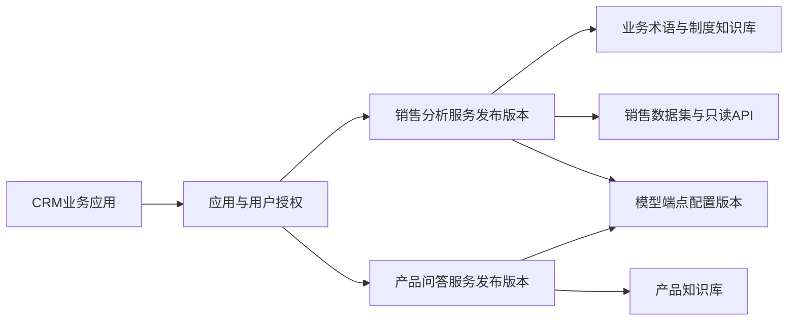

# 11 控制面页面与产品对象说明

本文件补充PRD，描述用户在管理后台看见的功能。页面落入现有web-ele菜单、路由、权限、表单、反馈和分页体系；不引入上游平台的另一套后台。所有默认值是设计建议，需在F08统一登记字段契约。

## 1. 应用、AI服务与知识库的关系

**业务应用**代表调用方，例如CRM；**AI服务**代表中台发布的能力组合，例如“销售分析助手”；**知识库**是可复用资源。业务系统使用发布服务，服务执行时按资源绑定及当前用户权限检索知识库。

- 一个应用可使用多个服务；一个服务可授权给多个应用。
- 一个服务可绑定多个知识库；同一个知识库可被多个服务复用，文档不因绑定而复制。
- 真正可检索范围是“应用获授权资源 ∩ 服务绑定资源 ∩ 当前主体可访问资源”。客户端指定的KB只可缩小范围。
- 知识更新产生文档/索引新版本；服务保持绑定资源。回答记录实际引用版本，撤销权限即时影响后续读取。
- APP身份适合机器任务，USER身份适合“我的客户/部门”类能力。应用注册不自动授予所有终端用户全库读取权。

例：销售服务同时绑定产品知识与销售数据。用户问“今年某产品销售额下降原因”，平台可以检索已授权产品资料并查询已登记销售指标；没有该用户的销售数据权限时，不能因为产品知识公开就执行销售查询。

## 2. 页面通用规则

1. 列表具备筛选、分页、加载、空态、失败重试；状态必须显示可读名称和更新时间。
2. 新建和修改采用独立ReqVO；普通修改不兼任启用、停用、轮换、发布、删除等高风险动作。
3. 更新携带版本号，409提示数据已变更，允许重新加载；不静默覆盖其他人的修改。
4. 重要操作显示对象、影响和处理结果。后端当前权限是最终判断，前端按钮权限只改善体验。
5. 密钥只显示“已配置”和更新时间；一次展示后不可查询恢复，复制动作不写日志或埋点。
6. 表单业务校验复用field-rules；通用报错沿用feedback/request约定，避免页面和全局重复提示。
7. 模型结果视为不可信输入。受控文本节点和类型化组件渲染，不使用v-html、innerHTML或任意模板表达式。
8. 开放平台调试采用明确测试主体和服务范围，不能借管理员身份绕过外部用户权限。

## 3. 首期菜单及页面交付

页面名是产品导航，最终路由沿用框架命名规范；权限码采用`ai:资源:动作`，由F08统一登记。下表给出拥有方任务，禁止页面自行新增一套服务逻辑。

| 页面 | 列表重点 | 表单/详情重点 | 独立操作 | 实现任务 |
|---|---|---|---|---|
| 模型管理 | 名称、provider、模型标识、能力、状态、最近探测 | 地址、模型ID、超时、网络策略、凭据配置状态 | 测试、探测、启停、轮换 | [M06](tasks/M06.md) |
| 应用接入 | appCode、名称、负责人、状态、允许域 | 应用信息、后端接入方式、配额、Origin列表 | 启停、发凭据、轮换、撤销 | [A09](tasks/A09.md) |
| 主体与授权 | 所属应用、外部用户键、状态、资源范围 | APP/USER、可信映射、服务及资源授权 | 停用主体、授权、撤销 | [A09](tasks/A09.md) |
| AI服务 | serviceCode、名称、草稿状态、在线版本 | 模型、提示词、输入Schema、KB/数据集/工具绑定、执行上限 | 调试、发布、回退、停用 | [S05](tasks/S05.md) |
| 开放API | 能力分类、版本、启用状态、scope | 请求响应、错误码、事件、限额、Java/JS示例 | 复制示例、测试调用 | [O08](tasks/O08.md) |
| 知识库 | 名称、文档数、索引版本、状态 | 所有者、应用与文档权限、embedding配置 | 入库、重建索引、检索调试 | [K09](tasks/K09.md) |
| 文档与入库任务 | 文档版本、来源、状态、失败原因 | 文件、sourceKey、位置、处理步骤、清理进度 | 上传、同步、重试、关闭可见性/删除 | [K09](tasks/K09.md) |
| 数据连接器 | 类型、所属应用、名称、连通状态 | API/MySQL专属配置、凭据状态、网络边界 | 测试、启停、发现允许资源 | [D10](tasks/D10.md) |
| 数据集与语义 | 名称、版本、就绪状态、schema漂移 | 字段、维度、指标、粒度、口径、枚举、权限策略 | 建议草稿、校验、发布版本、调试 | [D10](tasks/D10.md) |
| 工具 | 用途、输入输出、读写属性、政策 | 固定连接器operation、Schema、超时、幂等 | 测试、发布、AUTO/CONFIRM/DENY配置 | [D10](tasks/D10.md) |
| 报表 | 标题、模式、版本、数据截至时间、完整性 | 报表预览、数据与查询来源、当前权限 | 修改、保存、刷新、删除 | [R07](tasks/R07.md) |
| Chat集成 | 应用、发布版本、嵌入域、模式 | 接入步骤、主题预览、公开接入代码、事件说明 | 预览、发布、复制代码 | [C09](tasks/C09.md) |
| 主题管理 | 应用、主题版本、发布状态 | 品牌资产、色板、字号、密度、深浅色、布局 | 预览、发布、回退 | [C09](tasks/C09.md) |
| 运行监控 | runId、应用、服务、主体标识、状态、耗时 | 步骤摘要、资源引用、脱敏错误、取消状态 | 查看、允许的取消/重试 | [Q03](tasks/Q03.md) |
| 用量与限额 | 应用/服务/模型维度、时间区间 | token来源、调用次数、失败率、配额占用 | 筛选、调整授权范围内限额 | [Q03](tasks/Q03.md) |
| 质量评测 | 套件、版本、通过情况、失败分类 | 样例、期望、模型版本、实际结果、人工复核 | 运行、比较、绑定发布门禁 | [Q05](tasks/Q05.md) |

后台报表列表也必须遵守正文权限；管理菜单权限不等于能读取企业全部业务报表。若没有合法外部主体调试上下文，只能看脱敏元数据。

## 4. 关键配置表单

### 4.1 模型端点

| 字段 | 输入规则 | 变化影响 |
|---|---|---|
| name | 必填，1–100字符 | 展示名变更可独立更新 |
| provider | 从已交付适配器枚举选择 | 被发布服务引用后变更需新建端点并迁移发布 |
| baseUrl | 固定协议/主机/端口，满足网络允许策略 | 不接受用户运行时覆盖；被发布服务引用后地址变更新建端点 |
| upstreamModelId | 必填，1–200字符，保留实际模型版本描述 | 不能仅换同名模型后宣称效果不变 |
| capabilities | 平台声明且适配器已支持的集合 | 发布还检查最近验证与部署启用状态 |
| credential | 只写，使用统一加密；无查询回显 | 轮换使用专用动作，独立credentialRevision |
| timeoutPolicy | 从有边界的配置选择 | 非法值保存失败；不允许无限超时 |

### 4.2 应用与主体

appCode使用稳定业务键，建议`[a-z][a-z0-9_-]{2,63}`；发布接入后不可直接修改。Origin由scheme+host+port组成，不含path、query或通配符。生产使用精确HTTPS Origin，开发localhost规则放开发profile。

主体映射来源标记为“可信业务后端/企业身份源”，不得在浏览器输入角色、部门后直接变成服务端权限。首次换票可按应用批准策略建立主体记录，但**不自动获得未授予的行数据权限**。离职、调岗、停用和撤销必须有接入说明。

应用服务授权与资源授权分开编辑，页面显示两者交集后的可用能力。批量勾选不越过操作者自己的管理范围。默认新应用禁用、没有可执行服务与数据资源。

### 4.3 AI服务配置

基本信息、输入输出、模型与提示词、知识、数据、工具、执行限制、调试、发布记录使用分区或步骤表单。用户可先保存不完整草稿，发布必须完整校验。

资源选择器只显示操作者可配置的资源。选择的数据集尚未有可执行权限策略或处于schema漂移状态时，可以保留草稿，但不能发布。提示词预览仅展示用户配置内容及公开上下文摘要。

调试需要选择测试主体；对“上个月”等问题展示解析的时间范围及口径。确认工具显示名称、对象、参数摘要和有效期。平台内部隐藏推理不进入页面。

### 4.4 数据集语义编辑

至少包含以下五块：

1. **来源**：连接器、允许表/视图或固定API operation、元数据版本。
2. **字段**：逻辑code、物理映射、类型、中文名、单位、别名、敏感级别、可筛选/可展示资格。
3. **指标**：逻辑code、业务解释、确定性聚合定义、粒度、时间字段、去重/退款/null口径；禁止任意脚本。
4. **关系**：允许关联路径、主键、基数、聚合顺序；未证明不放大计数的关系不能发布。
5. **权限与验证**：可执行范围解析器、获授权主体、固定样例、schema漂移处理。

模型可提出草稿建议，但“建议”与“已发布”状态分开。对于“销售额”有多个可用口径的情况，保存别名不等于自动消除歧义；必须指定服务默认口径或向用户追问。

### 4.5 主题与布局

对照04中的ThemeTokens提供受控选项。主题预览同时显示文本、引用、错误、表格、三类图表和报表，不能只预览一个按钮。

视觉继承顺序：平台默认 → 应用已发布主题 → 发布配置允许的宿主运行时覆盖。行为与权限配置不在主题中。颜色必须通过格式和对比度检查；字体采用自托管白名单，不接受远程脚本/字体地址。

## 5. 开放API平台交付流程

1. 管理员发布服务并授权给应用。
2. 应用研发在开放平台看见实际已交付的API和有效scope。
3. 选择服务与测试主体，获取无秘密示例；客户端凭据经受控一次展示自行放入企业后端秘密配置。
4. 后端完成换票；使用API发起run并消费结果，或使用Chat SDK承载交互。
5. 运行详情可通过runId追踪，配额/错误/任务状态有明确解释。

上游模型端点的原始地址和密钥不通过开放API交给业务系统。对话API不能代替文件、知识同步、报表刷新等明确的业务接口。

## 6. 每页验收清单

- 新建/修改/查询/独立命令均有契约和权限测试，列表分页与详情引用一致。
- 表单必填、超长、重复键、非法地址、无效枚举、过期版本都有可理解错误。
- 查询无明文或密文秘密；错误、日志、复制示例和浏览器存储同样检查。
- 并发更新返回冲突；停止/撤销后旧页面执行操作被服务端拒绝。
- 空、加载、失败、无权、窄容器、深浅色及键盘流程通过对应组件与真实浏览器验证。
- 管理端/嵌入端复用能力实现；测试页与正式页面不采用不同权限路径。

## 7. 后续页面

X组增加媒体任务、实时语音、MCP接入、流程设计、Webhook和受控分享；Y组增加主体联邦、实体映射、跨源口径与查询诊断。只有相应任务验收后才出现在发布菜单和开放目录中。
